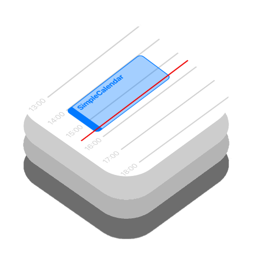

<p align="center">
    
</p>

<p align="center">
    
    
    
    
    <br/>
    <a href="https://mastodon.nu/@ppeelen" target="_blank">
        
    </a>
    <a href="https://twitter.com/ppeelen" target="_blank">
        
    </a>
</p>

# Simple Calendar
``SimpleCalendar`` brings the use of a _simple calendar_ right into your app. There are no fancy sliders nor is its purpose to mimic Apple's Calendar app. 
As its title suggests, it is meant to be a simple calendar.

Originally built for the [Swift Island](https://github.com/SwiftIsland/app) app, this calendar has since been separated to its own Github project so others 
so it can easily be integrated in other apps.

<p align="center">
    
    
</p>

## Installation

Simple Calendar can be installed with the Swift Package Manager:

```
https://github.com/ppeelen/SimpleCalendar.git
```

## Usage

Simple Calendar comes with documentation right inside Xcode, however here are some quick examples:

Adding a Simple Calendar is just one line of code:
```swift
SimpleCalendarView(
    events: eventList,
    selectionAction: .sheet
)
```

`eventList` in the example above is a list of `EventRepresentable` items; such as `Event`. See the example app for further examples.

When the user selects an event in the calendar, Simple Calendar can either inform using a closure, show the default sheet, a custom sheet or move to a custom destination.

## Documentation

You can find the documentation here: [https://ppeelen.github.io/SimpleCalendar/docs/documentation/simplecalendar](https://ppeelen.github.io/SimpleCalendar/docs/documentation/simplecalendar)
